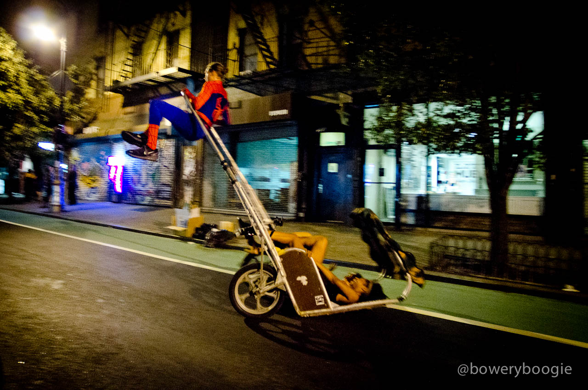

[](https://travis-ci.org/LiquidLabsGmbH/unexpected-webdriver)

# unexpected-webdriver

A plugin for [unexpected](http://unexpected.js.org) that adds assertions for the
[official WebDriver bindings](https://www.npmjs.com/package/selenium-webdriver)
from the Selenium project.



## Assertions

* `<WebElement> to exist`
* `<WebElement> to be visible`
* `<WebElement> to contain text <string+|regexp>`
* `<WebElement> to contain html <string+|regexp>`

## Example

```js
const webdriver = require('selenium-webdriver');
const expect = require('unexpected');

expect.use(require('unexpected-webdriver'));

const driver = new webdriver.Builder().forBrowser('firefox').build();

const el = driver.findElement({ id: 'hello' });
expect(el, 'to contain text', 'Hello World');
```

## Credits

Thanks to [Bowery Boogie](http://www.boweryboogie.com/) for their permission to use the photo of [Rickshaw Spidey](http://www.boweryboogie.com/2012/08/rickshaw-spidey-spotted-on-ludlow-street/) performing his unexpected moves.
